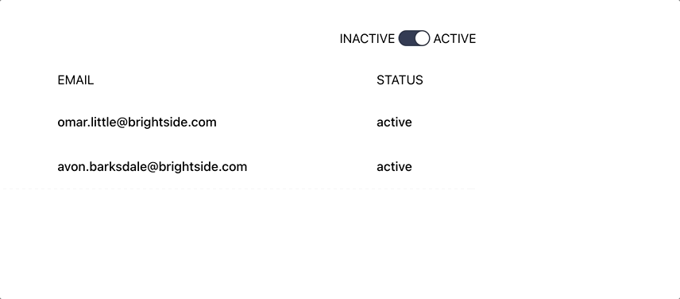
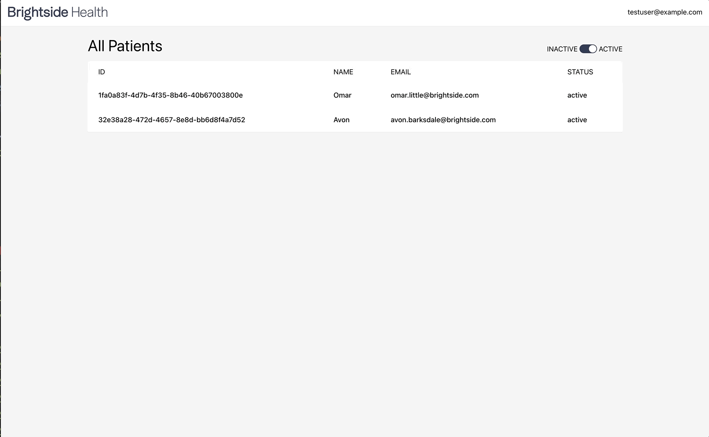

# Brightside Frontend Assessment

For this assessment, you will implement a couple small features for a fictional provider patient care application.

Please spend no more than 2 1/2 hours on this project. When you are done, please open a pull request with your work.

## Your tasks

### 1. Enable status filtering for the patients list page

As a provider, I want to be able to filter inactive patients from my list view by default. However, I still want to be able to view inactive patients. Add a switch component to the patients list view page, and default that switch on (i.e. filtering to view patients with an "active" status). If the switch component is toggled off, it should filter to view patients with an "inactive" status. The filtering should be done server-side (**NOTE: this is already implemented. Refer to the API swagger docs to see how to filter patients by status**).

**Switch Details:**

The filter switch should look like this:



- The switch component (not including the labels) is 40x20px
- The switch handle is 17x17px
- There is 0.25rem of margin between the switch and the labels
- The color of the switch when on is #343D55
- The color of the switch when off is #C2C5CC

### 2. Allow Provider to view a patient

As a provider, I want to be able to click in and view patient details. When I first load the app, I should be shown the patient list on the root path `/`. If I click on any patient row, I should be taken to the patient page at `/patients/:id`. If I click on the Brightside logo, I should be taken back to the root path.

**Patient Page Details:**

The navigation should behave like this:



When you load the patient page, be sure to put the patient details into a card. Basic information (name, email, phone) can be retrieved from the `/patients/:id` endpoint of the api. Although the navigation spec may show additional intake information, you can ignore this.

## Running the project

In order to complete this assessment, you need to run both the api and the client.

### To run the api

```bash
cd api
yarn install 
yarn start # the server will run on port 3000
```

Once you have the server running, you can navigate to <http://localhost:3000/documentation> to see Swagger documentation.

### To run the client

```bash
cd client 
yarn install 
yarn start # the application will be accessible from port 3001
```
